<!-- # book-thing.io

Initial wireframes:

https://wireframe.cc/x0a8I9

https://wireframe.cc/6oVXTU -->
# Crosspad

A web-application that allows anyone to search for a video-game, and then receive a list of options as buttons. Upon one being clicked, the screen
will focus to a tab about that game and other tabs pertaining to related titles and the reception of the game's franchise, based on aggregated critical ratings, will become available to view.

## Motivation

Video-games are a passion of mine. Having been born in '88, I grew up with a steady diet of Nintendo systems and games. I have had the pleasure of watching their evolution from glorified arcade ports to multi-million dollar projects that can rival cinema in their narrative and dramatic content. I thought it would be neat to create a tool that would help people grasp the reception of games, especially those which are entries in long running franchises, within the context of decades of development and growth in the technology and the aims of the industry.


## Screenshots
Landing:
Fullscreen: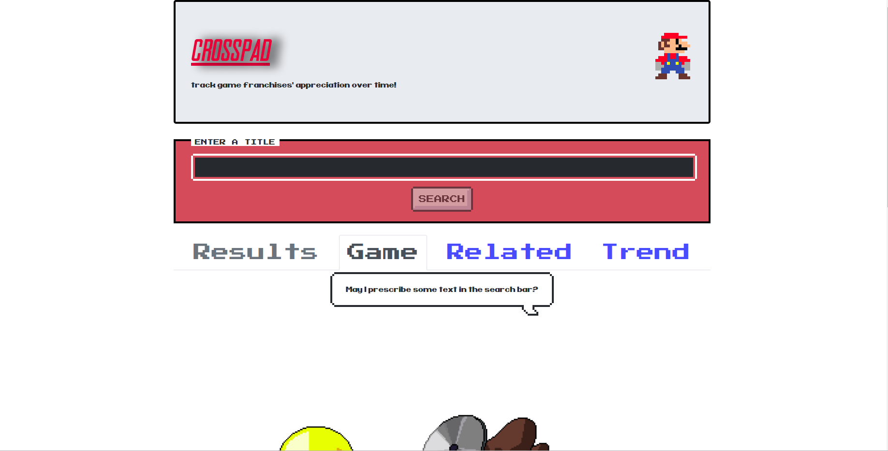

Mobile: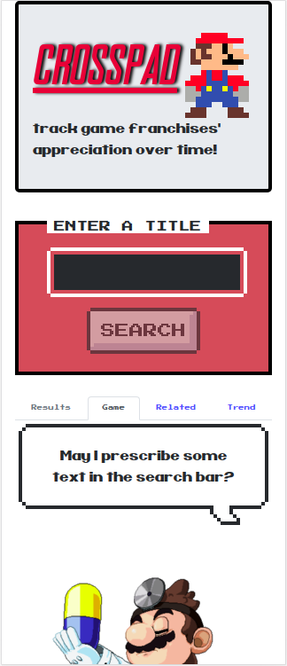

Loading:

Fullscreen: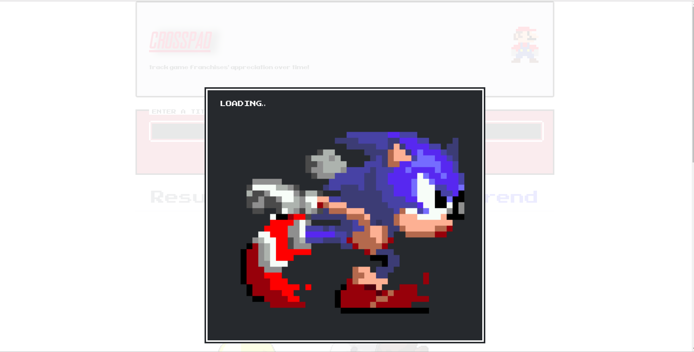

Mobile: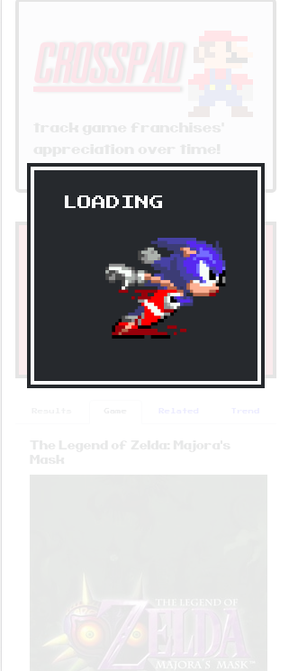

Game Tab

Fullscreen: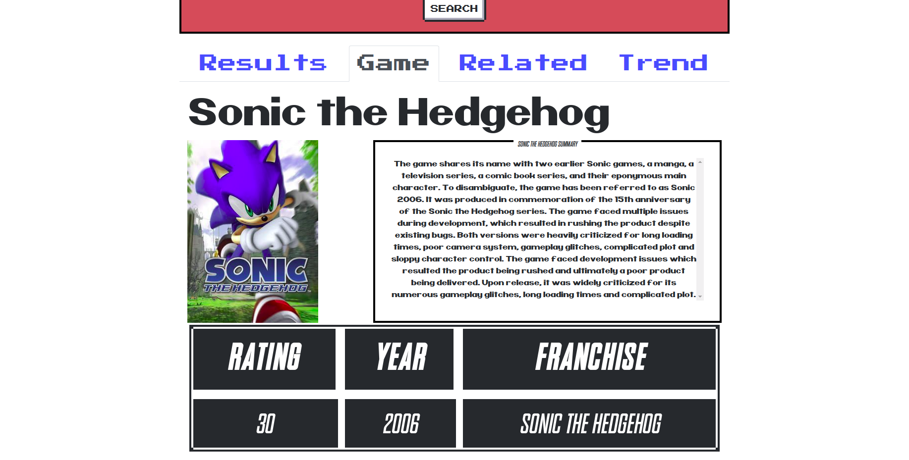
Mobile: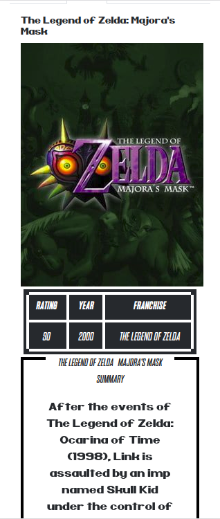

Results Tab

Fullscreen: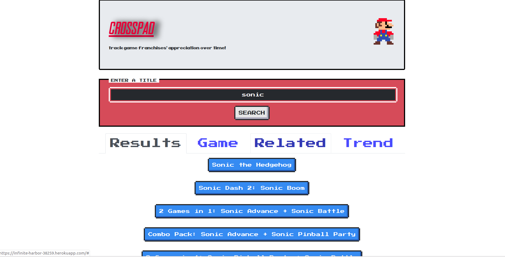
Mobile: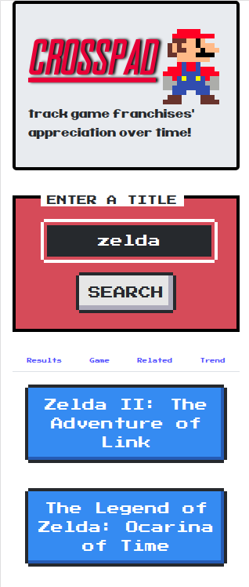

Related Games Tab

Fullscreen: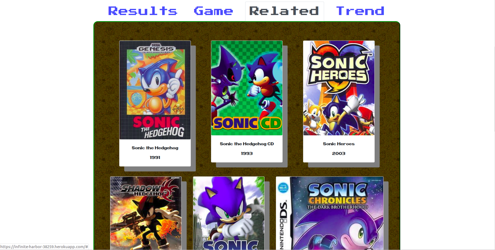
Mobile: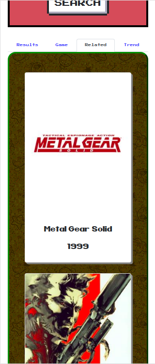

Ratings Tab

Fullscreen: 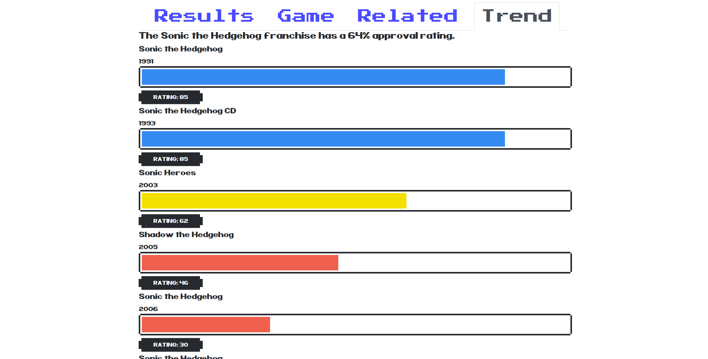
Mobile: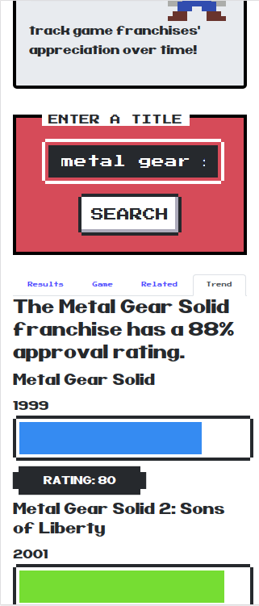


<!-- ## Environment Setup

1. You'll need to clone <INSERT LINK> and run 
```
npm install
```
then
```
npm start
```

2. Do the same for this package.

3. Open up a window at localhost:3000 -->


## Running the tests

To run all tests, run
```
npm test
```

## Built With

### Front-End
* React
* React Context
* Sass/SCSS
* NES.css

### Back-End
* Express
* Node

### Testing
* Jest
* React Testing Library

## Features

* Search for any video-game
* Receive a picture of the box art, and a summary of the title's premise.
* Receive information on the title's critical rating and year of release, along with games also in the same series.

## Running Project Link

- [Live](https://infinite-harbor-38259.herokuapp.com/)

## Authors

* **Adrian Rosales** - ** - Fullstack Web Development


## Acknowledgments

* **B.C. Rikko** - ** - For the use of nes.css
- [B.C. Rikko's Github](https://github.com/BcRikko)